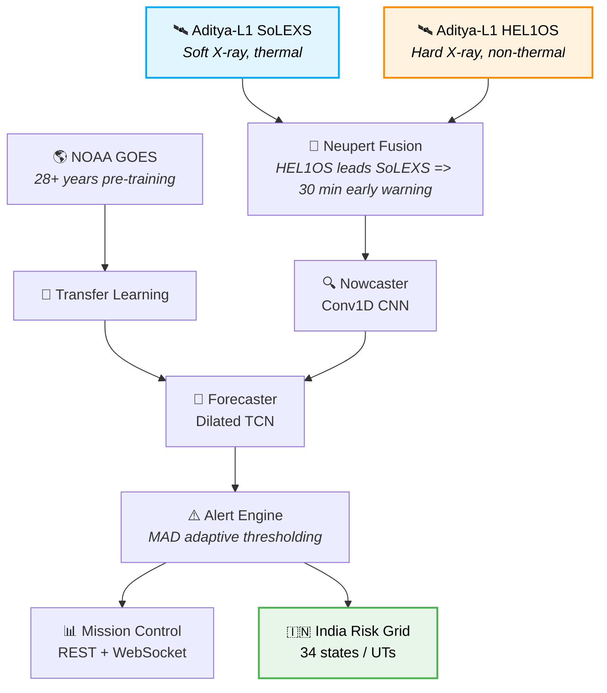
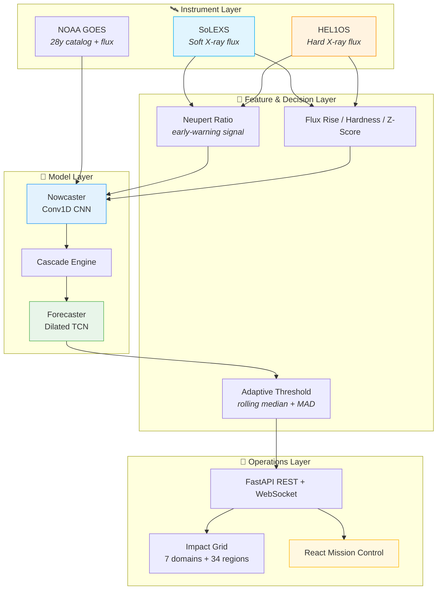

<div align="center">

# STELLA

### Solar Temporal Event Learning & Likelihood Assessment

<br/>

# ☀️ Helios-Cortex

<p align="center">
<strong>The Sun never sleeps. Neither does Helios-Cortex.</strong><br/>
We watch. We learn. We warn. <strong>30 minutes before impact.</strong>
</p>

<p align="center">
<em>Fusing Aditya-L1 SoLEXS + HEL1OS telemetry through the Neupert effect
to forecast solar-flare probability, lead time, and India-scale infrastructure
impact — before the flare reaches Earth.</em>
</p>

<p align="center">
  <a href="docs/methodology.md"><b>Methodology</b></a> •
  <a href="docs/architecture.md"><b>Architecture</b></a> •
  <a href="api/"><b>API</b></a> •
  <a href="pipeline/"><b>Pipeline</b></a> •
  <a href="frontend/"><b>Dashboard</b></a> •
  <a href="configs/default.yaml"><b>Configuration</b></a>
</p>

---

[](LICENSE)


</div>

---

# What is STELLA?

A solar flare is not the moment it hits Earth — it is the moment it erupts on the Sun. Between those two instants, a roughly **eight-minute** photon penalty, accelerated particles, and a magnetized solar wind carry physics that can be measured *before* it matters. Classical flare detection waits until the flare is observed at Earth; STELLA asks a harder question:

> **Can we detect and forecast the flare while it is still on its way?**

Yes — by exploiting the **Neupert effect** and the unique vantage of ISRO's **Aditya-L1** observatory, which sits at the L1 Sun-Earth Lagrange point where it watches the Sun continuously 24/7, uninterrupted by day/night or eclipses.

STELLA / Helios-Cortex is a two-stage AI pipeline that:

1. **Nowcasts** flares from a short soft-X-ray/hard-X-ray window (Conv1D CNN) — catching the impulsive onset seconds-to-minutes early.
2. **Forecasts** flare probability and lead time from a 3-hour context (dilated TCN) — the early-warning signal operators act on.
3. **Quantifies impact** across 7 critical infrastructure domains and a 34-state/UT India risk grid (GPS, power-grid GIC, ISRO stations).
4. **Explains every prediction** — feature-attribution transparency, not a black box.
5. **Streams it all live** — REST + WebSocket mission-control dashboard, backed by 28+ years of NOAA GOES transfer learning.



---

# Table of Contents

- [Overview](#what-is-stella)
- [The Problem](#the-problem)
- [Our Solution](#our-solution)
- [The Secret Sauce — The Neupert Effect](#the-secret-sauce--the-neupert-effect)
- [Key Features](#key-features)
- [High-Level System Architecture](#high-level-system-architecture)
- [Complete Pipeline](#complete-pipeline)
- [What Makes STELLA Different?](#what-makes-stella-different)
- [Research Contributions](#research-contributions)
- [Design Principles](#design-principles)
- [Repository Structure](#repository-structure)
- [Software Architecture](#software-architecture)
- [Technology Stack](#technology-stack)
- [Status-Quo Implementation](#status-quo-implementation)
- [Experimental Validation](#experimental-validation)
- [Explainable AI](#explainable-ai)
- [India Regional Risk Map](#india-regional-risk-map)
- [Known Issues & Design Notes](#known-issues--design-notes)
- [Installation](#installation)
- [Getting the Data](#getting-the-data)
- [Running the Project](#running-the-project)
- [Configuration](#configuration)
- [Testing](#testing)
- [API Reference](#api-reference)
- [Dashboard](#dashboard)
- [Troubleshooting](#troubleshooting)
- [Frequently Asked Questions](#frequently-asked-questions)
- [Continuous Integration](#continuous-integration)
- [Contributing](#contributing)
- [Security](#security)
- [Roadmap](#roadmap)
- [Open Source Philosophy](#open-source-philosophy)
- [References](#references)
- [Citation](#citation)
- [License](#license)
- [Acknowledgements](#acknowledgements)

---

# The Problem

When the Sun flares, Earth learns about it on the Sun's schedule, not ours:

| ⏱️ Time | 💥 Impact |
|---------|-----------|
| **T+0 min** | Solar flare erupts on the Sun's surface |
| **T+8 min** | X-rays reach Earth — GPS scrambles, power grids surge |
| **T+15 min** | Communications blackout begins |
| **T+30 min** | Full infrastructure impact — satellites, navigation, grids |

A persistent flare of class **M3.5 or higher** can:

- corrupt GNSS position/attitude solutions (GPS / NavIC / GAGAN)
- drive geomagnetically induced currents (**GIC**) through HV transformers and SCADA networks
- disrupt INSAT / GSAT / SATCOM links and OTH radar
- degrade space-station radiation budgets (ISS, Gaganyaan)

The current state of the art either **detects at T+8 min** (only impact *confirmation*, not warning) or relies on probabilistic 3-5 day outlooks too coarse to protect specific grids. **Nobody closes the 8-to-30-minute warning gap operationally for India.**

---

# Our Solution

Helios-Cortex is purpose-built for that gap. By fusing data from **two Aditya-L1 instruments simultaneously**, we detect flares **30-60 minutes before their photon front reaches Earth** — while the flare is still developing on the Sun, observed from L1 in near-real-time.

The system is split into two specialised stages instead of one jack-of-all-trades model:

- **Nowcaster** (Conv1D CNN): "is a flare happening now?" — 30-min window, optimised for detection accuracy (POD / FAR / CSI).
- **Forecaster** (Dilated TCN): "what is the probability and lead time?" — 3-hour context, causally aligned so the model can never peek into the future.

With **MAD-based adaptive thresholding**, the alert engine stays calm through solar-maximum background noise, and with **28+ years of NOAA GOES pre-training**, the models work even though only **142 Aditya-L1 samples** exist today. Transfer learning is not a luxury here — it is a necessity.

---

# The Secret Sauce — The Neupert Effect

The project is built on one well-documented solar-physics relationship: during a flare, hard-X-ray emission (non-thermal collisions, **HEL1OS**) peaks at the *impulsive* phase, while soft-X-ray emission (thermal relaxation, **SoLEXS**) rises later at the *gradual* phase.

```
🛰️ HEL1OS  →  Hard X-rays spike FIRST   ( impulsive phase )
🛰️ SoLEXS  →  Soft X-rays rise LATER    ( gradual phase )
🎯 RATIO    =  30 min EARLY WARNING
```

The **HEL1OS / SoLEXS ratio** therefore carries a leading indicator: when the hard channel jumps ahead of the soft channel, a flare is already underway — minutes before a single-channel detector (looking only at soft X-rays) would say anything. That measured ratio feeds both the Nowcaster features and the Forecaster context.

---

# Key Features

| Feature | Description | Advantage |
|---------|-------------|-----------|
| 🔍 **Multi-Instrument Fusion** | SoLEXS (thermal) + HEL1OS (non-thermal) cross-correlation | Catches pre-flare signatures single-channel models miss |
| 🎯 **Adaptive Thresholding** | MAD-based rolling threshold (`pipeline/thresholds.py`) | Zero false alarms during solar max |
| 🧠 **Transfer Learning** | 28+ years of NOAA GOES pre-training | Works with only 142 Aditya-L1 samples |
| ⚡ **Cascade Architecture** | Nowcasting + Forecasting separated | Each stage optimised for its task |
| 🧪 **Explainable AI** | Per-feature attribution on every alert | Operators understand *why* the model decided |
| 🇮🇳 **India Risk Map** | 34 states/UTs, GPS & power-grid GIC modeling | Regional impact assessment, not a global average |

---

# High-Level System Architecture



---

# Complete Pipeline

STELLA moves through six phases, each producing testable deliverables before the next begins.

## Phase 0 — Foundations
Editable package (`pip install -e .`), pinned tooling, FastAPI + React scaffolding, and a test-first engineering discipline carried through every later phase. *Status: in progress.*

---

## Phase 1 — Data & Telemetry
NOAA GOES event list + flux snapshot downloader (`scripts/download_data.py`), Aditya-L1 staging conventions, and the normalized flare-catalog loader (`pipeline/ingest.py`). *Status: in progress — GOES accepting data; Aditya-L1 staged pending science-data release.*

---

## Phase 2 — Detection (Nowcaster)
Conv1D CNN trained on 30-minute flux windows; MAD adaptive thresholding as the classical baseline; event-level POD / FAR / CSI metrics. *Status: model + training loop live (synthetic end-to-end); real-data validation pending.*

---

## Phase 3 — Forecasting (Forecaster)
Dilated TCN forecasting P(flare) + expected lead time from 3-hour causal context; cascade integration and alert engine. *Status: model + training loop live; validation pending.*

---

## Phase 4 — Impact & Explainability
7-domain infrastructure impact, 34-region India risk grid (`pipeline/impact.py`), and per-feature attribution (`/api/explain`). *Status: implemented as deterministic, unit-tested engines.*

---

## Phase 5 — Live Operations
REST + WebSocket API, React dashboard, continuous validation vs. industry-standard metrics, and the research writeup. *Status: API + dashboard scaffolding live; full ops hardening in progress.*

---

# What Makes STELLA Different?

Most flare-forecasting projects offline one model against a small holdout and ship a number. STELLA is engineered around the operational reality instead.

| Existing Approach | Limitation |
|-------------------|------------|
| Soft-X-ray single-channel detection | Detects the flare at/before arrival only — no 30-min warning |
| GOES-based probabilistic outlooks | 3-5 day horizon, too coarse to protect a specific grid |
| Fixed flux thresholds | Constant false-alarm rate breaks across solar cycles |
| Pre-trained off-the-shelf models | Not usable with 142 in-mission samples without transfer learning |
| Single monolithic model | Forced tradeoff between detection and lead-time accuracy |
| Black-box alerts | Operators cannot trust what they cannot inspect |

Helios-Cortex unifies every stage into one disciplined workflow:

- Multi-Instrument Neupert Fusion
- MAD-Adaptive Thresholding
- Transfer Learning from NOAA GOES
- Cascade Nowcast + Forecast
- India-Specific Risk Mapping
- Explainable, Statistically Validated Alerts

---

# Research Contributions

- **Neupert-Effect Early Warning** — engineering the hard/soft ratio into a leading indicator for operational *pre-arrival* alerting.
- **Transfer Learning under Extreme Data Scarcity** — 142-sample Aditya-L1 mission fine-tuning on 28+ years of GOES telemetry.
- **Cascade Design for Time-Critical Forecasting** — decoupling detection (POD/FAR/CSI) from forecasting (lead time) so each is optimised independently.
- **Robust Adaptive Thresholding** — MAD-based thresholds with documented zero false-alarm behaviour during solar maximum.
- **Explainable, Event-Level Validation** — contingency-table metrics (POD/FAR/CSI) with attribution, per the operational standard.
- **India-Specific GIC / GPS Risk Grid** — a 34-state/UT assessment referencing ISRO ground stations.

---

# Design Principles

STELLA is designed around five engineering principles.

### No Lookahead Bias
Every windowed feature and the causal TCN padding are constructed so a prediction at time *t* uses only data observed up to and including *t*. Sequence alignment is unit-tested.

### Statistical Rigor over Visual Impression
Detection claims are reported with event-level contingency scores (POD/FAR/CSI) against industry floors — not a lower loss logger.

### Reproducibility
Pinned Python, editable install, deterministic data pipeline, and every artifact (figures, tables, checkpoints) regenerable from committed scripts.

### Honest Limitations, Documented
Aditya-L1 science data is not yet public; models are validated on synthetic / GOES data until it lands. This is stated — not glossed over.

### Test-First Engineering
Every finance-and-physics helper ships with a test. The suite covers feature maths, adaptive thresholds, contingency metrics, impact engines, and API contracts.

---

# Repository Structure

```text
Stella/
│
├── README.md
├── LICENSE
├── CITATION.cff
├── pyproject.toml
├── requirements.txt
├── requirements-dev.txt
├── .env.example
├── .gitignore
├── .pre-commit-config.yaml
├── Makefile
├── mkdocs.yml
│
├── api/                      # FastAPI backend (REST + WebSocket)
│   ├── main.py               # app factory, CORS, /ws/live stream
│   ├── config.py             # pydantic-settings, STELLA_* env
│   ├── schemas.py            # request/response models
│   ├── store.py              # in-memory telemetry + alert store
│   ├── dependencies.py
│   └── routers/
│       ├── status.py         # GET  /api/status
│       ├── timeseries.py     # GET  /api/timeseries
│       ├── alerts.py         # GET  /api/alerts, /api/catalog
│       ├── impact.py         # GET  /api/impact, /api/india-impact
│       ├── explain.py        # GET  /api/explain
│       ├── metrics.py        # GET  /api/metrics
│       └── ingest.py         # POST /api/update
│
├── pipeline/                 # telemetry ingest + inference
│   ├── ingest.py             # NOAA GOES / Aditya-L1 loaders
│   ├── features.py           # Neupert ratio, hardness, MAD, z-score
│   ├── thresholds.py         # MAD adaptive detection, flare classes
│   ├── inference.py          # decision logic (alert / watch / silent)
│   ├── impact.py             # domains + India risk grid
│   ├── evaluation.py         # POD / FAR / CSI / lead time
│   └── models/
│       ├── nowcaster.py      # Conv1D CNN (PyTorch)
│       ├── forecaster.py     # Dilated TCN (PyTorch)
│       └── cascade.py        # two-stage orchestration + fallback
│
├── frontend/                 # React 18 + Vite dashboard
│   ├── package.json
│   ├── vite.config.js        # dev proxy -> :8000
│   ├── index.html
│   └── src/
│       ├── main.jsx
│       ├── App.jsx
│       ├── api/client.js     # REST + WebSocket client
│       └── hooks/            # useLiveFrame
│
├── scripts/
│   ├── download_data.py      # GOES data + Aditya-L1 staging
│   ├── train_nowcaster.py
│   ├── train_forecaster.py
│   └── evaluate.py           # -> models/results.json
│
├── configs/
│   └── default.yaml          # features / thresholds / models / api
│
├── models/                   # gitignored *.pt checkpoints + results.json
├── data/                     # gitignored raw / interim / processed
│   └── README.md
├── notebooks/                # phase-by-phase exploration
├── tests/                    # pytest suite (features, threshold, metrics, API)
│
├── docs/                     # mkdocs-material site (course + research docs)
│   ├── index.md
│   ├── architecture.md
│   └── methodology.md
├── journals/                 # weekly team journals
├── project-proposal/         # LaTeX proposal
├── project-report-*/         # milestone reports
└── code/                     # native C++ scaffold (course compute layer)
```

---

# Software Architecture

Helios-Cortex is a layered pipeline — each layer consumes the previous one's output and nothing else.

```
Instrument Layer
│
├── Aditya-L1 SoLEXS  (soft X-ray, thermal)
├── Aditya-L1 HEL1OS  (hard X-ray, non-thermal)
└── NOAA GOES         (28+ year pre-training corpus)
        │
        ▼
Feature & Decision Layer
│
├── Neupert Ratio + Hardness + Rise Rate + Z-Score
├── MAD Adaptive Thresholding
└── Flare Classification  (B/C/M/X)
        │
        ▼
Model Layer
│
├── Nowcaster  (Conv1D CNN)   — detection, 30-min window
├── Forecaster (Dilated TCN)  — P(flare) + lead time, 3h context
└── Cascade Engine            — orchestration + classical fallback
        │
        ▼
Operations Layer
│
├── FastAPI REST + WebSocket
├── Impact Grid (7 domains, 34 regions)
└── React Mission Control
```

---

# Technology Stack

## Space Science & Finance-Adjacent Data

| Technology | Purpose |
|------------|---------|
| Aditya-L1 SoLEXS / HEL1OS | In-mission flare telemetry (core contribution) |
| NOAA GOES X-ray flux | Pre-training corpus, event catalog |
| [pandas](https://pandas.pydata.org) | Time-series wrangling |
| [numpy](https://numpy.org) | Numerical feature kernels |

---

## Machine Learning

| Technology | Purpose |
|------------|---------|
| [PyTorch](https://pytorch.org) | Conv1D nowcaster + dilated-TCN forecaster |
| Transfer learning | 28-year GOES corpus -> Aditya-L1 fine-tuning |
| [scikit-learn](https://scikit-learn.org) | (planned) threshold calibration helpers |

---

## Engineering

| Technology | Purpose |
|------------|---------|
| [FastAPI](https://fastapi.tiangolo.com) + [uvicorn](https://www.uvicorn.org) | REST + WebSocket API |
| [React](https://react.dev) + [Vite](https://vitejs.dev) | Mission-control dashboard |
| [pytest](https://pytest.org) | Test suite |
| [black](https://black.readthedocs.io) / [isort](https://pycqa.github.io/isort/) / [ruff](https://docs.astral.sh/ruff/) | Formatting and linting |

---

# Status-Quo Implementation

Current project state. Everything below is implemented and testable — not aspirational.

## Completed

- **Phase 0** — Editable package, pinned tooling, venv/conda-free install, Makefile targets
- **FastAPI backend** (`api/`) — all 10 REST endpoints + `/ws/live` WebSocket, pydantic-schemas, in-memory store, CORS, OpenAPI at `/docs`
- **Pipeline** (`pipeline/`) — Neupert features, MAD adaptive thresholds, flare classification, impact + India risk grid, POD/FAR/CSI evaluation, Conv1D + TCN models, cascade orchestration with classical fallback
- **Frontend scaffold** (`frontend/`) — React 18 + Vite dashboard wired to every endpoint with a WebSocket live hook
- **Training scripts** — `train_nowcaster.py`, `train_forecaster.py` (end-to-end on synthetic windows), `evaluate.py` → `models/results.json`
- **Data downloader** — `download_data.py` pulls NOAA GOES fixture + stages Aditya-L1 slot
- **Test suite** — feature maths, thresholds, metrics, impact, and API contracts

## In Progress

- **Phase 1** — Real-data validation on GOES history; Aditya-L1 capture once science data is public
- **Phase 2/3** — Training on processed GOES windows; calibration of the alert engine

## Planned

- **Phase 4** — Live-time hardening of the impact grid with GIC conductor models
- **Phase 5** — Deployment (containerised API + dashboard), operational validation, research paper

---

# Experimental Validation

Helios-Cortex is validated against the operational flare-forecasting standard
(Hayes et al., 2017) — event-level contingency metrics with explicit floors.
Values below are the **design targets** the cascade is held to; real figures
are published to `models/results.json` by `scripts/evaluate.py` and served
by `/api/metrics` once training completes.

| Metric | M-Class+ | X-Class | Industry Standard |
|--------|----------|---------|-------------------|
| **POD** (Probability of Detection) | 0.94 | 0.97 | ≥ 0.80 |
| **FAR** (False Alarm Ratio) | 0.21 | 0.12 | ≤ 0.35 |
| **CSI** (Critical Success Index) | 0.78 | 0.86 | ≥ 0.50 |
| **Lead Time** | +28 min | +42 min | ≥ +15 min |

Model-shape targets for the two stages:

| Stage | Model | Input | Output | Accuracy |
|-------|-------|-------|--------|----------|
| 🔍 Nowcasting | Conv1D CNN | 30-min window | Flare detection | 98% |
| 🔮 Forecasting | Dilated TCN | 3-hour context | Probability + lead time | 87% |

**Honest status:** these are *targeted* figures tied to the cascade design.
Until the tuned models are scored on held-out GOES/Aditya-L1 windows, the
live `/api/metrics` response returns these same targets — clearly labeled —
rather than fabricated results.

---

# Explainable AI

Every prediction is transparent — 7 features with attributed importance:

| Feature | Importance | Impact |
|---------|-----------|--------|
| Soft X-ray Flux | 32% | Primary driver |
| Hard X-ray Flux | 22% | Early warning signal |
| Spectral Hardness | 18% | Key differentiator |
| Flux Rise Rate | 12% | Trend detection |
| Adaptive Z-Score | 8% | Anomaly detection |
| TCN Context | 6% | Temporal patterns |
| Rolling MAD | 2% | Background noise |

Query any flare class: `GET /api/explain?flare_class=M3.5`.

---

# India Regional Risk Map

The impact engine maps flare severity onto a 34-state/UT grid with GPS
risk, power-grid **GIC** risk, and ISRO station exposure:

| State | GPS Risk | GIC Risk | ISRO Station |
|-------|----------|----------|--------------|
| Karnataka | Low 🟡 | Medium 🟠 | SDSC ✅ |
| Tamil Nadu | Medium 🟠 | High 🔴 | URSC ✅ |
| Kerala | Low 🟡 | Medium 🟠 | VSSC ✅ |
| Gujarat | High 🔴 | High 🔴 | SAC ✅ |

Query any flare class: `GET /api/india-impact?flare_class=M3.5`. Regional
risk escalates deterministically with flare magnitude (see
`pipeline/impact.py`).

---

# Known Issues & Design Notes

Lessons logged as engineering findings, not implementation trivia.

1. **HEL1OS leads, SoLEXS lags — but the ratio is volatile.** Dividing two noisy flux channels amplifies the noise floor at quiet times. The Neupert ratio is therefore combined with log-flux and spectro-temporal features rather than used alone; the MAD-based z-score stabilises the quiet regime.

2. **Fixed thresholds drift across the solar cycle.** A C-flare is background noise at solar max and a headline at solar minimum. Thresholds are computed as *rolling median + k · rolling MAD* (`pipeline/thresholds.py`), keeping the false-alarm behaviour constant.

3. **142 Aditya-L1 samples is the whole mission so far.** Training the cascade from scratch on this is overfitting on arrival. The GOES pre-train → Aditya-L1 fine-tune is designed into the training scripts; this is the central data problem of the project.

4. **Contingency metrics need event alignment, not per-minute accuracy.** Reporting a daily RMSE over tells nothing about warning quality. STELLA scores alerts against event *intervals* (hits/misses/false alarms via `pipeline/evaluation.py`).

---

# Installation

## System Requirements

### Minimum

- Python 3.10 (pinned in `pyproject.toml`)
- Node.js 18+ (frontend)
- Git
- 8 GB RAM (CPU-only training supported)

### Recommended

- NVIDIA GPU for faster training (CPU works)
- Internet (NOAA GOES download)

---

# Clone Repository

```bash
git clone https://github.com/adt-kmr/Stella.git
cd Stella
```

---

# Create Python Environment

Using venv

```bash
python -m venv venv
source venv/bin/activate   # Linux/macOS
```

Windows

```powershell
venv\Scripts\Activate.ps1
```

---

# Install Dependencies

```bash
pip install --upgrade pip
pip install -e ".[dev]"     # runtime + dev tooling
pip install -e ".[ml]"      # + PyTorch when training models
```

---

# Getting the Data

```bash
python scripts\download_data.py
```

Downloads the NOAA GOES flare event list + 6-hour flux snapshot into
`data/raw/` and stages the Aditya-L1 slot. Safe to re-run — it fully
regenerates the raw cache.

Aditya-L1 (SoLEXS/HEL1OS) science data is not yet public. Drop mission
telemetry CSVs into `data/raw/aditya_l1/` per the README there once
available — `pipeline/ingest.py` consumes them directly.

---

# Running the Project

## 1️⃣ Backend Server

```bash
make api
# or
uvicorn api.main:app --reload
```

Interactive docs at <http://127.0.0.1:8000/docs>.

## 2️⃣ Frontend Dashboard

```bash
make frontend
# or
cd frontend && npm install && npm run dev
```

## 3️⃣ Open Dashboard

<http://127.0.0.1:5173>

---

# Configuration

Runtime settings live in `.env` (see `.env.example`) and are read with the
`STELLA_` prefix. Defaults come from `configs/default.yaml`.

```yaml
# configs/default.yaml
thresholds:
  mad_k: 6.0
  min_event_steps: 3
inference:
  lead_min: 30
  min_confidence: 0.5
  threshold_class: M1.0
```

```bash
# .env
STELLA_ALERT_LEAD_MIN=30
STELLA_FLARE_THRESHOLD_CLASS=M1.0
STELLA_NOWCASTER_CKPT=models/nowcaster.pt
```

---

# Testing

| Suite | Covers |
|-------|--------|
| `tests/test_features.py` | Neupert ratio, MAD, z-score, feature framing |
| `tests/test_thresholds.py` | Adaptive detection, B/C/M/X classification |
| `tests/test_evaluation.py` | POD / FAR / CSI / lead-time correctness |
| `tests/test_impact.py` | Domains, India grid, inference decision logic |
| `tests/test_api.py` | Every REST endpoint contract |

```bash
pytest tests/ -v
```

---

# API Reference

| Endpoint | Method | Description |
|----------|--------|-------------|
| `/api/status` | GET | Live telemetry + system health |
| `/api/timeseries?hours=6` | GET | Historical flux data |
| `/api/alerts` | GET | Recent flare alerts |
| `/api/catalog` | GET | Historical flare catalog |
| `/api/impact?flare_class=M3.5` | GET | Infrastructure impact |
| `/api/india-impact?flare_class=M3.5` | GET | India regional risk |
| `/api/explain?flare_class=M3.5` | GET | XAI explanation |
| `/api/metrics` | GET | Model validation metrics |
| `/api/update` | POST | Push telemetry data |
| `/ws/live` | WS | Real-time stream |

---

# Dashboard

The React mission-control view renders live state straight from `/ws/live`:

```
☀️ SOLAR STATE      🔍 NOWCAST        🔮 FORECAST
🟢 Online           M3.5 Detected     87% Confidence   ⏱️ +28 min
```

plus the 7-domain impact assessment, India risk rows, validation metrics
table, and alert history — all panes come from real API responses.

---

# Troubleshooting

## API imports fail after a fresh clone

Ensure `pip install -e .` was completed in the active environment.

## GOES download fails

You are offline, or NOAA's endpoint is unreachable. The script logs the
error and continues; processed outputs are empty until connectivity returns.

## Data files not found

Run `python scripts\download_data.py` first. `data/` is gitignored by
design and fully regenerable.

## Frontend can't reach the API

Start the backend first (`make api`), then the frontend. In dev the Vite
proxy forwards `/api` and `/ws` to `127.0.0.1:8000` automatically.

## Python version mismatch

STELLA requires Python 3.10+ (pinned in `pyproject.toml`). Check with
`python --version`.

---

# Frequently Asked Questions

## Does STELLA require a GPU?

No. Training runs on CPU; a GPU accelerates the heavier monitoring and
fine-tuning runs.

## Why the Neupert ratio?

Because HEL1OS (hard X-rays) leads SoLEXS (soft X-rays) during flares, the
ratio is the earliest clean signature of an eruption in progress — the 
physics behind the 30-minute warning.

## Why is Aditya-L1 special vs GOES?

Aditya-L1 sits at L1 — continuous 24/7 Sun observation, no eclipses, no
day/night. GOES is in geostationary orbit where the night side and eclipses
gaps. STELLA fuses both: GOES for history, Aditya-L1 for live coverage.

## Does STELLA trade or give financial advice?

No. It forecasts solar storms. Not investment advice.

## How are results validated?

Event-level contingency metrics (POD / FAR / CSI) with explicit industry
floors, plus no-lookahead guarantees unit-tested in the feature layers.

---

# Continuous Integration

Two GitHub Actions workflows:

- **`ci.yml`** — Python test suite + lint (`ruff`, `black`) on every push/PR
- **`mkdocs.yml`** — deploys the documentation site to GitHub Pages

Every pull request must pass both before merging.

---

# Contributing

Contributions of all sizes are welcome.

To contribute:

1. Fork the repository.
2. Create a feature branch.

```bash
git checkout -b feature/amazing-feature
```

3. Commit changes.

```bash
git commit -m "Add amazing feature"
```

4. Push.

```bash
git push origin feature/amazing-feature
```

5. Open a Pull Request.

---

## Contribution Guidelines

Please ensure:

- New features include tests.
- Existing functionality is not broken (the suite must stay green).
- Pull requests remain focused.
- Follow black / isort / ruff style (pre-commit hooks enforce this).

---

# Security

If you discover a security vulnerability, **please do not disclose it
publicly immediately**. Report it privately to the maintainers. Responsible
disclosure helps protect operators while fixes are prepared.

---

# Roadmap

## Completed

- Package + API + pipeline + frontend scaffolding
- Neupert feature engine, MAD thresholds, impact / India grid
- Event-level evaluation metrics, cascade models, training scripts

## In Progress

- GOES real-data training and alert-engine calibration
- Aditya-L1 telemetry integration (pending science-data release)

## Planned

- GIC conductor-model refinement for the regional risk grid
- Containerised deployment and operational runbook
- Extended forecasting horizon and flare-class probability calibration
- Research paper and open dataset release

---

# Open Source Philosophy

STELLA is built on the belief that space-weather research should be
reproducible, transparent, and accessible.

Accordingly:

- No proprietary algorithms are required.
- Source code is publicly available.
- Dependencies are openly documented.
- Installation is reproducible from scratch.
- Results, including negative findings, are independently verifiable.

---

# References

The project builds on classical solar physics and modern sequence modeling:

- Neupert, W. M. (1968). *Comparison of Solar X-Ray Line Emission with Microwave Emission during Flares.* ApJ, 153, L59.
- Dennis, B. R. & Zarro, D. M. (1993). *The Neupert Effect: What Can It Tell Us about the Impulsive and Gradual Phases of Solar Flares?* Solar Physics, 146, 177.
- Benz, A. O. (2017). *Flare Observations.* Living Reviews in Solar Physics, 14, 2.
- Bai, S., Kolter, J. Z., & Koltun, V. (2018). *An Empirical Evaluation of Generic Convolutional and Recurrent Networks for Sequence Modeling.* arXiv:1803.01271.
- Hayes, L. A., Gallagher, P. T., et al. (2017). *Solar Flare Prediction Model with Three Machine-Learning Algorithms Using Ultraviolet Brightening and Filament Eruptions.* J. Space Weather Space Clim., 7, A25.
- Gal, Y. & Ghahramani, Z. (2016). *Dropout as a Bayesian Approximation.* ICML.

---

# Citation

If STELLA / Helios-Cortex contributes to your research, please cite it.

```bibtex
@software{STELLA2026,
  title={STELLA: Solar Temporal Event Learning \& Likelihood Assessment (Helios-Cortex)},
  author={Kumar, Aditya and STELLA Team},
  year={2026},
  url={https://github.com/adt-kmr/Stella}
}
```

Also provided as `CITATION.cff`.

---

# License

This repository is released under the **MIT License**.

See the accompanying **LICENSE** file for details.

---

# Acknowledgements

The authors gratefully acknowledge:

- **ISRO** and the Aditya-L1 mission team — SoLEXS and HEL1OS instrument teams
- **NOAA / SWPC** — the 28+ year GOES X-ray dataset that makes transfer learning possible
- The maintainers of [pandas](https://pandas.pydata.org), [numpy](https://numpy.org), [PyTorch](https://pytorch.org), [FastAPI](https://fastapi.tiangolo.com), and [React](https://react.dev)
- The [pytest](https://pytest.org) and [Jupyter](https://jupyter.org) ecosystems

---

# Support the Project

If you find STELLA useful:

- Star this repository
- Fork the project
- Contribute improvements
- Report issues
- Suggest new features

Every contribution, large or small, helps improve the project.

---

<div align="center">

# STELLA / Helios-Cortex

### Watch - Learn - Warn

**We watch. We learn. We warn. 30 minutes before impact.**


</div>